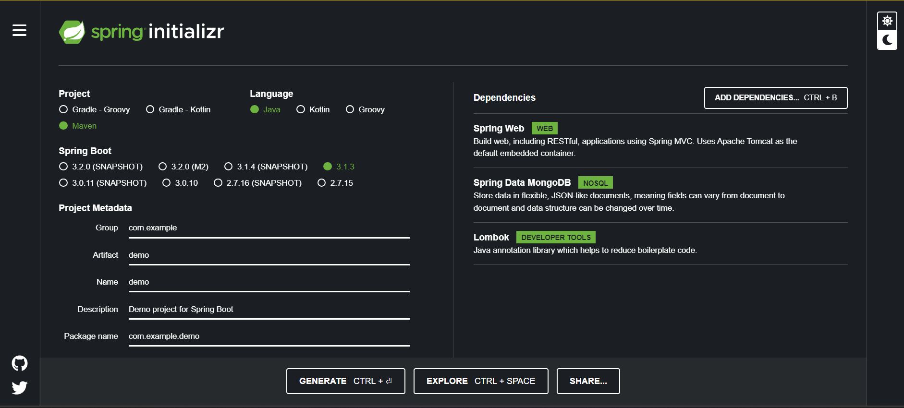
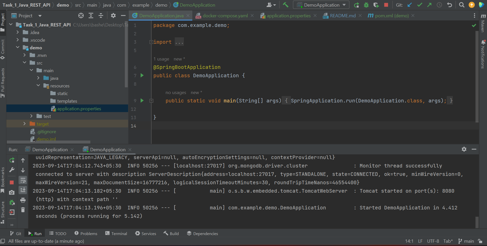

# Task_1_Java_REST_API
# Java REST API with Spring Boot and MongoDB

This is a simple example of creating a RESTful API using Java, Spring Boot, and MongoDB. In this project, we will set up a basic REST API with CRUD operations (Create, Read, Update, Delete)

## Prerequisites

Before you begin, ensure you have the following prerequisites installed:

- Java 8 or higher
- Maven
- MongoDB (Make sure MongoDB is running on your system or specify the connection details in the application properties) or we can us Docker to run mongoDB 
- Docker Desktop

## Getting Started
# Setting Up a Spring Boot Project using Spring Initializr

This guide will walk you through the process of creating a Java Spring Boot project using the Spring Initializr web application. We'll configure the project with essential dependencies to kickstart your development.

## Step 1: Access Spring Initializr

1. Open your web browser and navigate to the [Spring Initializr](https://start.spring.io/) web application.

## Step 2: Configure Your Project

2. Configure your project by providing the following details:

   - **Project**: Select "Maven Project."
   - **Language**: Choose "Java."
   - **Spring Boot**: Choose the latest stable version.
   - **Group**: Specify your project's group ID, for example, `com.yourcompany`.
   - **Artifact**: Enter your project's artifact ID, for example, `your-rest-api`.
   - **Name**: Provide a name for your project.
   - **Description**: Add a brief description of your project.
   - **Packaging**: Select "Jar" (default).
   - **Java**: Choose "8" or a higher version (e.g., "11").

3. Add the following dependencies to your project:

   - **Spring Web**: Build web, including RESTful, applications using Spring MVC. Uses Apache Tomcat as the default embedded container.
   - **Spring Data MongoDB**: Store data in flexible, JSON-like documents, meaning fields can vary from document to document and data structure can be changed over time.
   - **Lombok**: Java annotation library which helps to reduce boilerplate code.

## Step 3: Generate Your Project

4. Click the "Generate" button to generate your project.

## Step 4: Download and Extract

5. The Spring Initializr will generate a zip file containing your project files. Download and extract this zip file to your preferred location.

You've now successfully set up a Spring Boot project using Spring Initializr. The generated project contains the specified dependencies and serves as a solid foundation for building your Java application.

Feel free to modify the project structure, add more dependencies, and start developing your Java application as needed.




After extracting the file open the file with your favourate code editor here we will be using IntelliJ IDEA.


# Setting Up MongoDB and MongoDB Express using Docker Compose

To facilitate database management during development, you can use Docker Compose to run MongoDB and MongoDB Express in containers. Follow these steps to set it up:

## Step 1: Create a Docker Compose Configuration File

1. In your project's root folder, create a new directory named `demo` if it doesn't already exist.

2. Inside the `demo` folder, create a new file named `docker-compose.yaml`.

3. Paste the following Docker Compose configuration into the `docker-compose.yaml` file:

```yaml
version: "3.8"
services:
  mongodb:
    image: mongo
    container_name: mongodb
    ports:
      - "27017:27017"
    volumes:
      - mongodb-data:/data/db
    environment:
      MONGO_INITDB_ROOT_USERNAME: rootuser
      MONGO_INITDB_ROOT_PASSWORD: rootpass
  mongo-express:
    image: mongo-express
    container_name: mongo-express
    restart: always
    ports:
      - "8081:8081"
    environment:
      ME_CONFIG_MONGODB_ADMINUSERNAME: rootuser
      ME_CONFIG_MONGODB_ADMINPASSWORD: rootpass
      ME_CONFIG_MONGODB_SERVER: mongodb

volumes:
  mongodb-data: {}

```
# Running MongoDB and MongoDB Express Containers

To start MongoDB and MongoDB Express containers using Docker Compose, follow these steps:

## Step 1: Navigate to Your Project Directory

1. Open your terminal or command prompt.

2. Navigate to your project's root directory where the `docker-compose.yaml` file is located.

Execute the following command to start the containers in detached mode:
```docker-compose up -d```


### how head to your browser and type ```localhost:8081```


### now open application.properties from demo/src/main/resources/application.properties and write the following command
# MongoDB Configuration

To configure your Spring Boot application to connect to MongoDB, you'll need to update the `application.properties` file located in the `demo/src/main/resources` folder. Use the following configuration properties to set up the connection:

```properties
spring.data.mongodb.authentication-database=admin
spring.data.mongodb.username=rootuser
spring.data.mongodb.password=rootpass
spring.data.mongodb.database=sampledb
spring.data.mongodb.port=27017
spring.data.mongodb.host=localhost
```
and in local host create a database name sampledb as shown below


## Now run the DemoApplication.java and it should run successfully now
